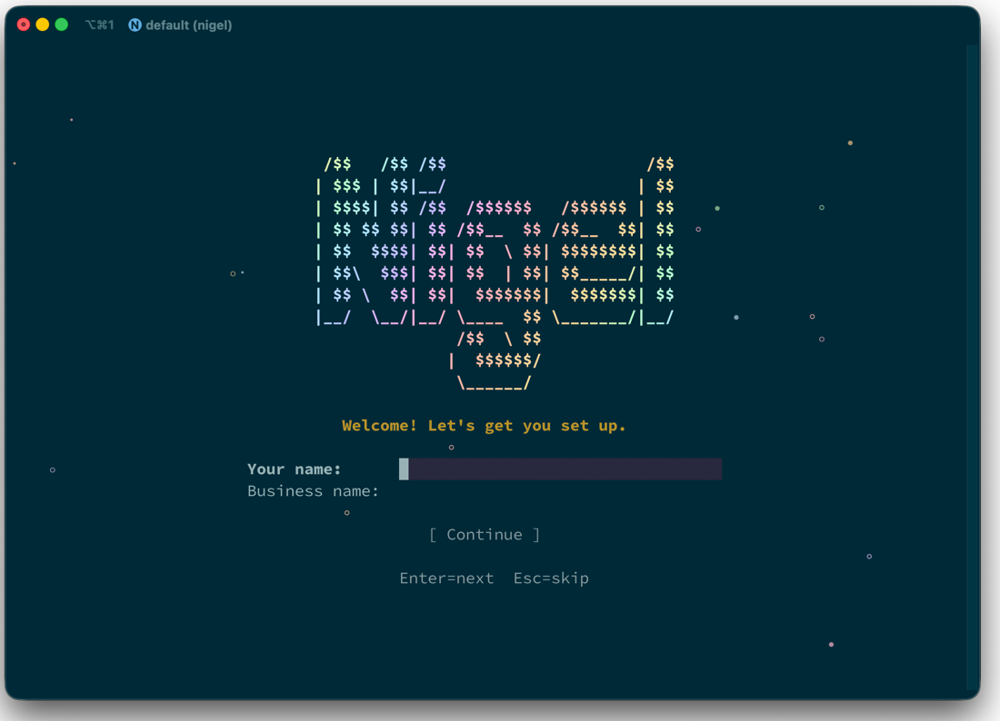
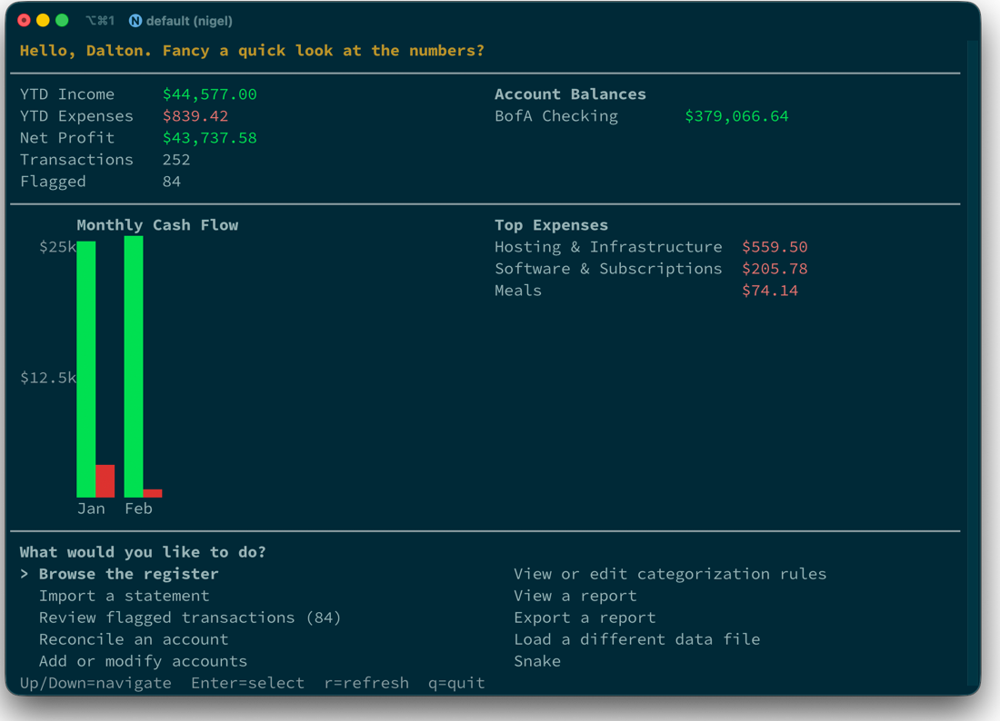

# Nigel



Nigel is a cash-basis bookkeeping CLI for small consultancies. Replace QuickBooks with a simple, local-first workflow: import bank CSVs and payroll reports, auto-categorize transactions via rules, review flagged items, and generate reports — all from the terminal.

Nigel is designed for humans but works extremely well with AI agents. The repo includes [Claude skills](docs/skills.md) to add new importers and intelligently create new rules from your statements before importing into Nigel. With a tool like Claude Cowork, point it at your CSV statement and say "Import my latest statements into Nigel and generate my monthly P&L" or "Generate a Schedule K-1 prep report for 2026."



Nigel also includes a **demo mode** — `nigel demo` which generates more than a year's worth of sample transactions so you can get a feel for things without entering any real data. Take the full [walkthrough tour](docs/walkthrough.md) and explore the dashboard, register, accounts and rules, review flagged transactions, and run every report.

## Features

- **Interactive dashboard** — run `nigel` to access your dashboard with YTD financials, account balances, a monthly income/expense chart, and a command menu; browse, review, import, reconcile, manage accounts and categories, view rules, view/export reports, and switch data files.
- **Bank imports** — CSV/XLSX parsers with format auto-detection; `--dry-run` to preview without writing
- **Generic CSV** — import any CSV with `--date-col`, `--desc-col`, `--amount-col`; save reusable profiles with `--save-profile`
- **Payroll import** — XLSX payroll importer with auto-categorization
- **Duplicate detection** — file-level checksums and transaction-level matching prevent double-imports
- **Auto-snapshot** — automatic database snapshot before every import for easy rollback
- **Undo imports** — `nigel undo` rolls back the last import, removing its transactions after confirmation
- **Rules engine** — pattern-based auto-categorization (contains, starts_with, regex) with priority ordering; test patterns with `nigel rules test` before committing
- **Interactive review** — step through flagged transactions with a pinned category chart, assign categories, and create rules on the fly; press Esc to go back and redo previous transactions
- **Reports** — Profit & Loss, expense breakdown, tax summary (IRS Schedule C / 1120-S), cash flow, balance, K-1 prep; interactive ratatui views by default with date navigation (Left/Right arrows to page between periods, `m` to toggle month/year), with `--mode export` for PDF or `--format text` for text files
- **Interactive browser** — paginated register browser showing all transactions, starting at today with full backwards scrolling, keyboard navigation, jump-to-date, and transaction search
- **PDF export** — export any report to PDF or text with `nigel report <type> --mode export`
- **Monthly reconciliation** — compare calculated balances against bank statements
- **SQLite storage** — single portable database, no server required
- **Database encryption** — optional SQLCipher encryption; set a password during onboarding or manage via the Settings screen (`p` from dashboard) or `nigel password set`; returning users enter their password inline on the splash screen; backups preserve encryption state
- **Settings screen** — edit business name and manage database password from the dashboard (`p` key)
- **Snake** - 🍎 🐍

Importers currently include Bank of America and Gusto, but adding a new importer is straightforward. See [docs/importers.md](docs/importers.md) for more information. The repository also contains a Claude skill that can create an importer from any data file. Contributions for importers for widely used import formats are welcome.

## Install

Download a pre-built binary from [GitHub Releases](https://github.com/madebyraygun/nigel-keeps-your-books/releases), or build from source:

```bash
cargo install --path .
```

## Quick Start

```bash
# Initialize — prompts for data directory on first run
nigel init

# Load sample data to explore
nigel demo

# Launch the interactive dashboard
nigel

# Or set up your own accounts
nigel accounts add "BofA Checking" --type checking --institution "Bank of America"

# Import transactions
nigel import statement.csv --account "BofA Checking"

# Preview an import without writing to the database
nigel import statement.csv --account "BofA Checking" --dry-run

# Import a generic CSV with custom column mapping
nigel import statement.csv --account "Chase" --date-col 0 --desc-col 1 --amount-col 3

# Save a reusable profile for future imports
nigel import statement.csv --account "Chase" --date-col 0 --desc-col 1 --amount-col 3 --save-profile chase

# Use a saved profile
nigel import statement.csv --account "Chase" --format chase

# Undo the last import
nigel undo

# Manage accounts
nigel accounts rename 1 "New Name"
nigel accounts delete 3

# Test a rule pattern before creating it
nigel rules test "ADOBE" --match-type contains

# Add a categorization rule
nigel rules add "ADOBE" --category "Software & Subscriptions" --vendor "Adobe"

# Re-run categorization
nigel categorize

# Review flagged transactions
nigel review
nigel review --id 185                 # Re-review a specific transaction by ID

# View reports (interactive ratatui views)
nigel report pnl --year 2025
nigel report expenses --month 2025-03
nigel report tax --year 2025
nigel report cashflow
nigel report balance
nigel report flagged
nigel report register --year 2025   # Transaction register

# Export reports
nigel report pnl --year 2025 --mode export            # PDF
nigel report pnl --year 2025 --mode export --format text  # Text file
nigel report all --year 2025                           # All reports to PDF
nigel report all --year 2025 --output-dir ~/exports/   # Custom directory

# Interactive register browser (all transactions, starts at today)
nigel browse register
nigel browse register --year 2025                     # Filter to a specific year
nigel browse register --account "BofA Checking"

# Reconcile against a bank statement
nigel reconcile "BofA Checking" --month 2025-03 --balance 12345.67

# See what's active
nigel status

# Switch between data directories
nigel load ~/other-books

# Back up your database
nigel backup
nigel backup --output /tmp/nigel-backup.db

# Restore from a backup
nigel restore ~/Documents/nigel/backups/nigel-20250301-120000.db

# Database encryption
nigel password set                                # Encrypt database with a password
nigel password change                             # Change existing password
nigel password remove                             # Decrypt database (remove password)

# Shell completions
nigel completions bash                            # Also: zsh, fish, powershell
```

## Configuration

Settings are stored in `~/.config/nigel/settings.json`. The data directory defaults to `~/Documents/nigel/` and can be changed by re-running `nigel init --data-dir <path>`. Use `nigel load <path>` to switch between existing data directories without reinitializing. `nigel status` shows the active database and summary statistics.

## Feature Flags

| Flag | Default | Description |
|------|---------|-------------|
| `gusto` | Yes | Gusto payroll XLSX importer + auto-categorization |
| `pdf` | Yes | PDF export via printpdf (built-in Helvetica, no font files needed) |

Build without Gusto support:

```bash
cargo build --release --no-default-features
```

## Development

```bash
cargo build              # Debug build
cargo build --release    # Release build
cargo test               # Run all tests
cargo test --no-default-features  # Test without gusto/pdf features
```

## License

MIT
