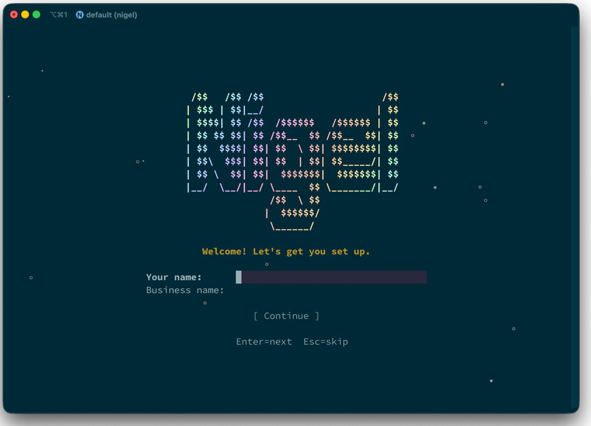
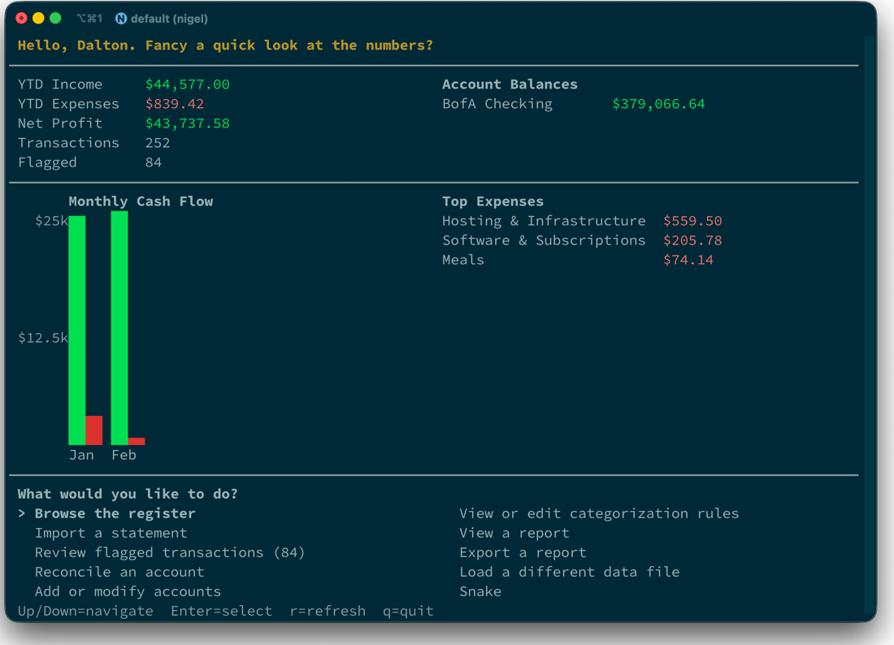

# Nigel



Nigel is a cash-basis bookkeeping CLI for small consultancies — and for personal finances. Replace QuickBooks with a simple, local-first workflow: import bank CSVs and payroll reports, auto-categorize transactions via rules, review flagged items, and generate reports — all from the terminal. Choose **business books** (a Schedule C / Form 1120-S chart of accounts, tax summaries, and a K-1 prep worksheet) or **personal books** (a household chart of accounts with the same imports, rules, review, and reports) during onboarding or with `nigel init --profile personal`.

Nigel is designed for humans but works extremely well with AI agents. The repo includes [Claude skills](docs/skills.md) to add new importers and intelligently create new rules from your statements before importing into Nigel. With a tool like Claude Cowork, point it at your CSV statement and say "Import my latest statements into Nigel and generate my monthly P&L" or "Generate a Schedule K-1 prep report for 2026."



Nigel also includes a **demo mode** — `nigel demo` which generates more than a year's worth of sample transactions so you can get a feel for things without entering any real data. Take the full [walkthrough tour](docs/walkthrough.md) and explore the dashboard, register, accounts and rules, review flagged transactions, and run every report.

## Features

- **Interactive dashboard** — run `nigel` to access your dashboard with YTD financials, account balances, a monthly income/expense chart, and a command menu; browse, review, import, reconcile, manage accounts and categories, view rules, view/export reports, and switch data files.
- **Bank imports** — CSV/XLSX parsers with format auto-detection; `--dry-run` to preview without writing
- **Generic CSV** — import any CSV with `--date-col`, `--desc-col`, `--amount-col`; save reusable profiles with `--save-profile`
- **Payroll import** — XLSX payroll importer with auto-categorization
- **Duplicate detection** — file-level checksums and transaction-level matching prevent double-imports
- **Auto-snapshot** — automatic database snapshot before every import for easy rollback
- **Undo imports** — `nigel undo` rolls back the last import, removing its transactions after confirmation
- **Rules engine** — pattern-based auto-categorization (contains, starts_with, regex) with priority ordering; test patterns with `nigel rules test` before committing
- **Bulk recategorization** — `nigel recategorize` moves transactions between categories by ID or by filters (category, date range, pattern, account, amount), with `--dry-run` preview and confirmation for filter-based moves
- **Interactive review** — step through flagged transactions with a pinned category chart, assign categories, and create rules on the fly; press Esc to go back and redo previous transactions
- **Reports** — Profit & Loss, expense breakdown, tax summary (IRS Schedule C / 1120-S), cash flow, balance, K-1 prep; interactive ratatui views by default with date navigation (Left/Right arrows to page between periods, `m` to toggle month/year), with `--mode export` for PDF or `--format text` for text files
- **Interactive browser** — paginated register browser showing all transactions, starting at today with full backwards scrolling, keyboard navigation, jump-to-date, and transaction search
- **PDF export** — export any report to PDF or text with `nigel report <type> --mode export`
- **Invoicing** — draft invoices for your clients, publish them as a static page and PDF on Cloudflare R2, email them via Mailgun with a Stripe payment link attached, and pull payments back in with `nigel invoice sync`; manual payments, A/R aging, and a one-time InvoiceShelf import are included. See [docs/invoicing.md](docs/invoicing.md)
- **Monthly reconciliation** — compare calculated balances against bank statements
- **Personal books** — `nigel init --profile personal` seeds a household chart of accounts (groceries, rent, utilities, …) instead of the business one; the K-1 worksheet steps aside and everything else works the same. Transfers between your own accounts (the `Transfer` category) never count as income or spending in any report, on either profile
- **Web UI** — `nigel serve` runs a local web interface and JSON API from the same binary on 127.0.0.1, opening a browser with a one-time session link; nothing is exposed to your network. Every report the CLI prints is there too, for any period, with text and PDF downloads and a print-friendly layout
- **SQLite storage** — single portable database, no server required
- **Database encryption** — optional SQLCipher encryption; set a password during onboarding or manage via the Settings screen (`p` from dashboard) or `nigel password set`; returning users enter their password inline on the splash screen, or in the browser when using `nigel serve`; backups preserve encryption state
- **Auto-updater** — checks GitHub Releases for new versions on launch (once per 24 hours); run `nigel update` to download and install the latest binary in-place; opt out via the Settings screen or `update_check: false` in settings.json
- **Settings screen** — edit business name, manage database password, and toggle auto-update checks from the dashboard (`p` key)
- **Snake** - 🍎 🐍

Importers currently include Bank of America and Gusto, but adding a new importer is straightforward. See [docs/importers.md](docs/importers.md) for more information. The repository also contains a Claude skill that can create an importer from any data file. Contributions for importers for widely used import formats are welcome.

## Install

Download a pre-built binary from [GitHub Releases](https://github.com/madebyraygun/nigel-keeps-your-books/releases), or build from source:

```bash
cargo install --path .
```

## Quick Start

```bash
# Initialize — prompts for data directory on first run
nigel init

# Or keep personal books instead of business books
nigel init --profile personal

# Load sample data to explore
nigel demo

# Launch the interactive dashboard
nigel

# Or set up your own accounts
nigel accounts add "BofA Checking" --type checking --institution "Bank of America"

# Import transactions
nigel import statement.csv --account "BofA Checking"

# Preview an import without writing to the database
nigel import statement.csv --account "BofA Checking" --dry-run

# Import a generic CSV with custom column mapping
nigel import statement.csv --account "Chase" --date-col 0 --desc-col 1 --amount-col 3

# Save a reusable profile for future imports
nigel import statement.csv --account "Chase" --date-col 0 --desc-col 1 --amount-col 3 --save-profile chase

# Use a saved profile
nigel import statement.csv --account "Chase" --format chase

# Undo the last import
nigel undo

# Manage accounts
nigel accounts rename 1 "New Name"
nigel accounts delete 3

# Test a rule pattern before creating it
nigel rules test "ADOBE" --match-type contains

# Add a categorization rule
nigel rules add "ADOBE" --category "Software & Subscriptions" --vendor "Adobe"

# Re-run categorization
nigel categorize

# Review flagged transactions
nigel review
nigel review --id 185                 # Re-review a specific transaction by ID

# Recategorize transactions non-interactively (by ID, or in bulk by filters)
nigel recategorize 185 212 --category "Software & Subscriptions"
nigel recategorize --from-category "Cost of Goods Sold" --year 2025 --category "Supplies" --dry-run
nigel recategorize --from-category "Cost of Goods Sold" --year 2025 --category "Supplies" --yes

# View reports (interactive ratatui views)
nigel report pnl --year 2025
nigel report expenses --month 2025-03
nigel report tax --year 2025
nigel report cashflow
nigel report balance
nigel report flagged
nigel report register --year 2025   # Transaction register

# Export reports
nigel report pnl --year 2025 --mode export            # PDF
nigel report pnl --year 2025 --mode export --format text  # Text file
nigel report all --year 2025                           # All reports to PDF
nigel report all --year 2025 --output-dir ~/exports/   # Custom directory

# Interactive register browser (all transactions, starts at today)
nigel browse register
nigel browse register --year 2025                     # Filter to a specific year
nigel browse register --account "BofA Checking"

# Invoicing (see docs/invoicing.md for the Stripe/R2/Mailgun setup)
nigel client add "Acme Co" --email ap@acme.test
nigel invoice new --client 1 --issue 2026-08-04 --item "Consulting:10:150"
nigel invoice send 1248                               # Publish, email, attach a payment link
nigel invoice sync                                    # Record Stripe payments
nigel invoice pay 1248 --date 2026-08-20              # Record a payment received directly
nigel invoice aging                                   # A/R aging

# Reconcile against a bank statement
nigel reconcile "BofA Checking" --month 2025-03 --balance 12345.67

# See what's active
nigel status

# Switch between data directories
nigel load ~/other-books

# Back up your database
nigel backup
nigel backup --output /tmp/nigel-backup.db

# Restore from a backup
nigel restore ~/Documents/nigel/backups/nigel-20250301-120000.db

# Database encryption
nigel password set                                # Encrypt database with a password
nigel password change                             # Change existing password
nigel password remove                             # Decrypt database (remove password)

# Web UI (localhost only)
nigel serve                                       # Opens a browser at 127.0.0.1:5731
nigel serve --port 8080 --no-open                 # Custom port, print the URL instead

# Check for and install updates
nigel update

# Shell completions
nigel completions bash                            # Also: zsh, fish, powershell
```

## Automated backups

`nigel backup` uses SQLite's online-backup API, so it produces a consistent snapshot even while Nigel is running, and an encrypted database yields an encrypted backup. Copying `nigel.db` with `cp` or a file-sync tool does **not** give you this — such a copy can catch the database mid-write, along with an out-of-step `-wal` file, and may not restore.

On an encrypted database, `nigel` normally prompts for the password on the terminal. Scheduled jobs have no terminal, so set `NIGEL_DB_PASSWORD` instead:

```bash
NIGEL_DB_PASSWORD="$(security find-generic-password -s nigel-db -w)" \
  nigel backup --output ~/Documents/nigel/backups/nigel-$(date +%F).db
```

`NIGEL_DB_PASSWORD` is fatal when unusable — wrong, empty, or not valid UTF-8 — rather than falling back to a prompt no scheduled job could answer. An empty value reports itself as empty, since the usual cause is the secret lookup failing rather than a bad password. Leave the variable unset for normal interactive use; while it is set, it takes precedence over the prompt even in a terminal.

A plaintext database ignores the variable entirely, so a value left over in your shell cannot lock you out of a database that never had a password.

Put this in a wrapper script rather than directly in a launchd plist: `ProgramArguments` execs without a shell, so command substitution, `~`, and `VAR=value` prefixes are all inert there. Launch agents also start with a minimal `PATH` that excludes `~/.cargo/bin`, so call `nigel` by absolute path.

Read the password from a secret store, as above, rather than writing it into a script or a plist. Note that an environment variable is visible to other processes running as you (`ps -E` on macOS), so on a shared account prefer running the backup interactively.

## Configuration

Settings are stored in `~/.config/nigel/settings.json`. The data directory defaults to `~/Documents/nigel/` and can be changed by re-running `nigel init --data-dir <path>`. Use `nigel load <path>` to switch between existing data directories without reinitializing. `nigel status` shows the active database and summary statistics. Set `"update_check": false` to disable automatic update checks on launch. Invoicing credentials (Stripe, Mailgun, Cloudflare R2) also live in `settings.json` or in matching `NIGEL_*` environment variables — see [docs/invoicing.md](docs/invoicing.md).

`nigel serve` binds 127.0.0.1 only and generates a fresh session token on every start, so the URL it prints is what grants access — it is never saved to disk. Requests from any other host or origin are refused. An encrypted database stays locked until you enter its password in the browser; the password is held in memory for that run only. See [docs/api.md](docs/api.md) for the endpoint inventory and security model.

The browser's Settings screen covers the same ground as the dashboard's: business name, the auto-update check, setting, changing or removing the database password, and switching data directories (which reloads the page onto the new books). Switching away from a database whose password you have forgotten is a terminal job — `nigel load` — because that screen is behind the same lock as everything else.

## Feature Flags

| Flag | Default | Description |
|------|---------|-------------|
| `gusto` | Yes | Gusto payroll XLSX importer + auto-categorization |
| `pdf` | Yes | PDF export via printpdf (built-in Helvetica, no font files needed) |
| `serve` | Yes | `nigel serve` web UI and JSON API (axum + embedded assets) |

Build without Gusto, PDF, and web server support:

```bash
cargo build --release --no-default-features
```

Individual features can be re-enabled, e.g. `--no-default-features --features serve`.

## Development

```bash
cargo build              # Debug build
cargo build --release    # Release build
cargo test -- --test-threads=1    # Run all tests (serial — the DB password is a process global)
cargo test --no-default-features -- --test-threads=1   # Without gusto/pdf/serve
```

### Building the web UI

`nigel serve` serves a single-page app that is compiled into the binary. It
lives in `web/` and needs Node 20.19 or newer (22 recommended):

```bash
cd web
npm ci
npm run build            # writes web/dist, which the binary embeds
```

`cargo build` works without Node — the binary then serves a placeholder page
explaining that the UI has not been built. Run the `npm run build` above before
`cargo build --release` if you want a binary with the real interface in it.

For the live dev loop (Vite on :5173 proxying to a running `nigel serve`), the
component preview harness, and the theme and API conventions, see
[web/README.md](web/README.md).

## License

MIT
