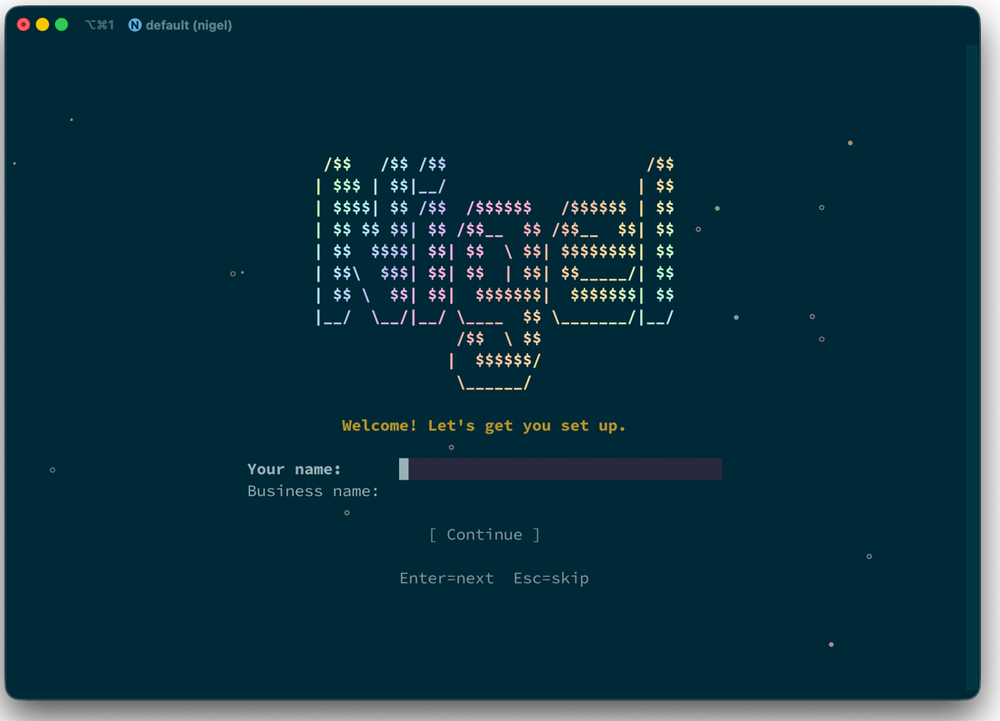
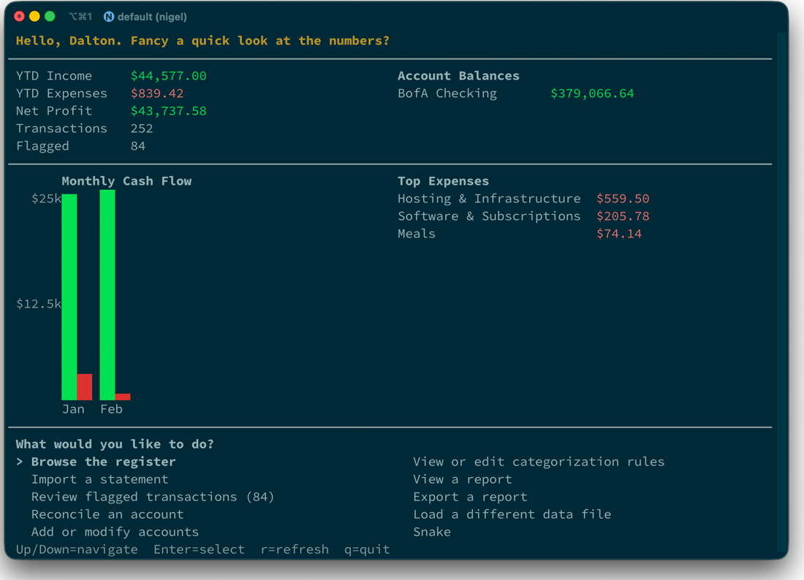
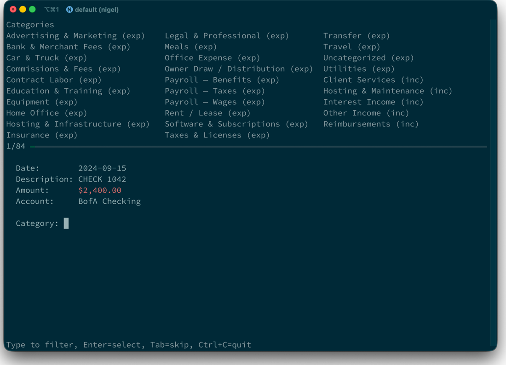
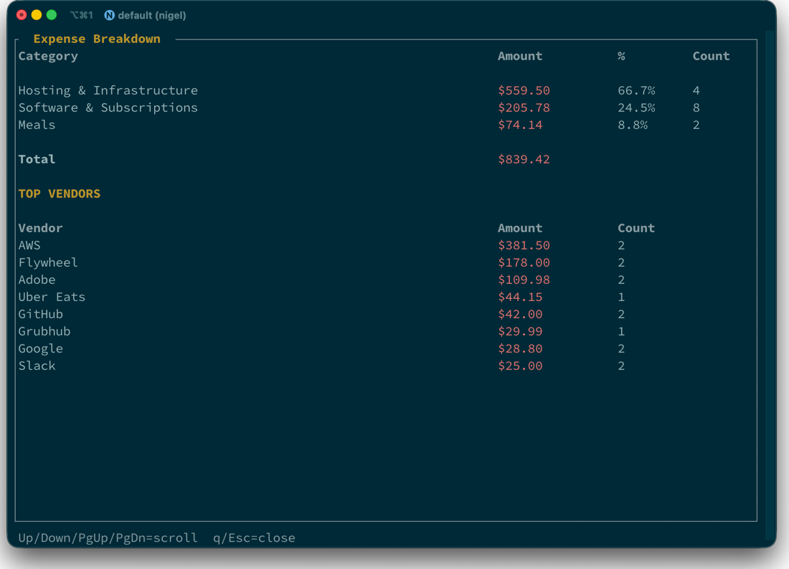
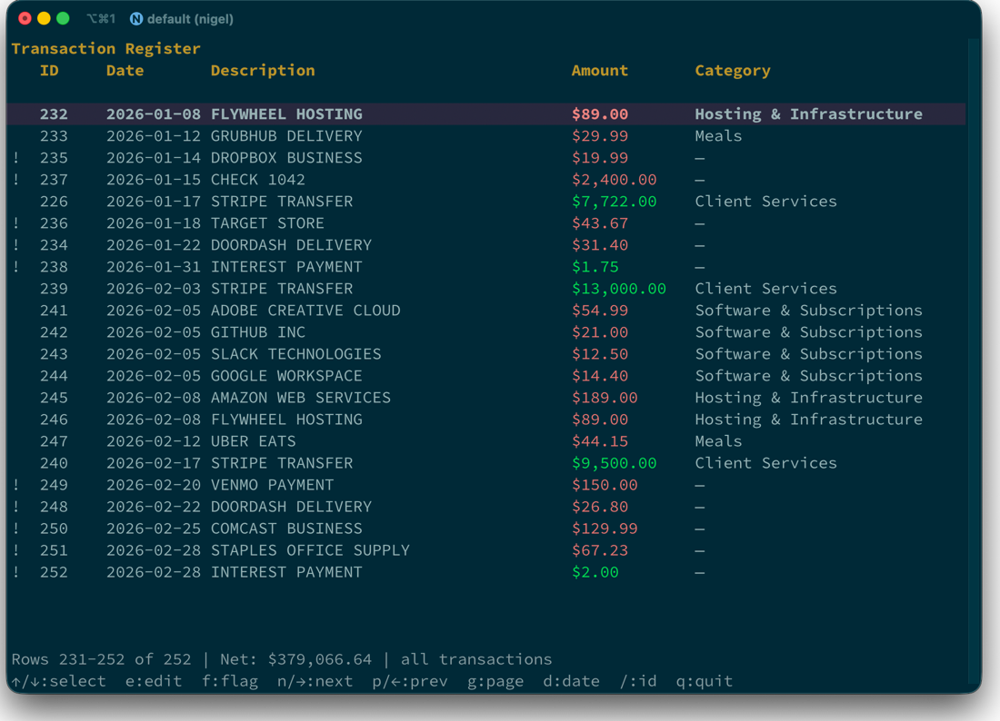

# Walkthrough: Exploring Nigel with Demo Data

This walks through a complete tour of Nigel using the built-in demo data — exploring accounts, reviewing flagged transactions, adding rules, and running reports.

## 1. Set up and load demo data

On first launch, Nigel shows an onboarding screen to collect your name and business name:



The onboarding offers three choices: view the demo, start fresh, or load an existing data directory. Choose "View the demo" to get started right away.

You can also load demo data any time from the command line:

```
$ nigel demo
Demo data loaded!
  Account:      BofA Checking
  Transactions: 252
  Rules:        9
  Categorized:  ...
  Flagged:      ...

Try these next:
  nigel accounts list
  nigel rules list
  nigel report pnl
  nigel report flagged
  nigel review
```

Nigel created a checking account with 18 months of sample transactions (dynamically generated from the current date backwards), added 9 categorization rules, and auto-categorized everything it could. The remaining transactions are flagged for review.

Running `nigel` with no arguments launches the interactive dashboard — your main hub for everything:



The dashboard shows YTD financials, account balances, a monthly cash flow chart, and a menu to browse, review, import, reconcile, manage accounts and rules, view or export reports, and switch data files.

## 2. Explore what's there

```
$ nigel accounts list
```
```
Accounts

ID  Name              Type       Institution      Last Four
1   BofA Checking     checking   Bank of America
```

```
$ nigel rules list
```
```
Rules

ID  Pattern               Type      Vendor       Category                    Priority  Hits
1   STRIPE TRANSFER       contains  Stripe       Client Services             0         ...
2   ADOBE                 contains  Adobe        Software & Subscriptions    0         ...
3   GITHUB                contains  GitHub       Software & Subscriptions    0         ...
4   SLACK                 contains  Slack        Software & Subscriptions    0         ...
5   GOOGLE WORKSPACE      contains  Google       Software & Subscriptions    0         ...
6   AMAZON WEB SERVICES   contains  AWS          Hosting & Infrastructure    0         ...
7   FLYWHEEL              contains  Flywheel     Hosting & Infrastructure    0         ...
8   UBER EATS             contains  Uber Eats    Meals                       0         ...
9   GRUBHUB               contains  Grubhub      Meals                       0         ...
```

## 3. Check what's flagged

```
$ nigel report flagged
```

This shows all transactions that didn't match any rule — they need to be categorized manually or covered by new rules.

## 4. Add rules for known vendors

Before reviewing one-by-one, knock out the obvious ones with rules:

```
$ nigel rules add "COMCAST" --category "Utilities" --vendor "Comcast"
Added rule: 'COMCAST' → Utilities

$ nigel rules add "STAPLES" --category "Office Expense" --vendor "Staples"
Added rule: 'STAPLES' → Office Expense

$ nigel rules add "ZOOM" --category "Software & Subscriptions" --vendor "Zoom"
Added rule: 'ZOOM' → Software & Subscriptions

$ nigel rules add "INTEREST PAYMENT" --category "Interest Income" --vendor "Bank of America"
Added rule: 'INTEREST PAYMENT' → Interest Income

$ nigel categorize
... categorized, ... still flagged
```

New rules knock out a chunk of flagged transactions. The rest go through manual review.

## 5. Review flagged transactions

Run `nigel review` to step through the remaining flagged items. Nigel shows a full-screen TUI with the category list pinned at the top, a progress bar, and the transaction details:



Type to filter categories — as you type, matching categories appear below the input. Use Up/Down to select, Enter to confirm. After picking a category, you can optionally set a vendor name and create a rule for future matches.

- **Tab** skips a transaction you're unsure about
- **Esc** goes back to re-review the previous transaction (undoing its categorization and any rule that was created)
- **Ctrl+C** quits

## 6. Reconcile

Reconcile against a known balance:

```
$ nigel reconcile "BofA Checking" --month 2025-01 --balance 17480.37
Reconciled! Calculated: $17,480.37
```

## 7. Run reports

```
$ nigel report pnl
```


This shows an interactive P&L for the current year. Since demo data spans 18 months, there will always be income and expenses in the current year.

```
$ nigel report expenses
```



You can also browse the full transaction register interactively:

```
$ nigel browse register
```



The register starts at today and scrolls backwards through all transactions. Use arrow keys to navigate, `e` to edit a transaction's category or vendor inline, `f` to toggle flags, `d` to jump to a date, and `/` to search by ID.

Other reports to try:

```
nigel report tax               # Tax summary by IRS line items
nigel report cashflow          # Monthly inflows/outflows
nigel report balance           # Cash position across accounts
nigel report flagged           # Remaining flagged transactions
nigel report k1 --year 2025   # K-1 prep worksheet (1120-S)
```

Export any report to PDF or text:

```
nigel report pnl --mode export                # PDF
nigel report pnl --mode export --format text  # Text file
nigel report all --year 2025                  # All reports to PDF
```

## Monthly routine

Once you're set up with real data, the monthly cycle is four commands:

```
nigel import <statement.csv> --account "BofA Checking"
nigel review
nigel reconcile "BofA Checking" --month YYYY-MM --balance <ending balance>
nigel report pnl --month YYYY-MM
```

Rules accumulate over time. After a few months, most transactions auto-categorize on import and `nigel review` gets shorter and shorter.
